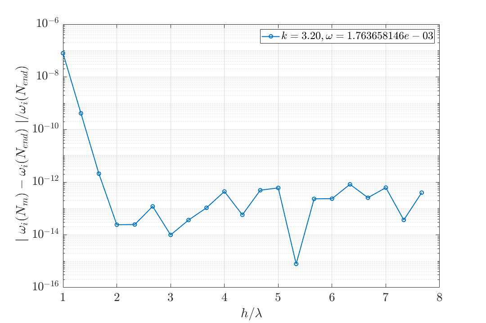

# 短波長處與論文的差異

在k大的地方(branch 2尾端)計算結果對不上Zhang(1996)的結果

## 截斷高度收斂?

改截斷高度測試收斂性(convergence_H.m)

判斷特徵值收斂 : 前後項相對誤差$$<10^{-10}$$

#### 結果:

以$$k=3.2$$為例，在Zhang(1996)應該是stable。

截斷高度大於兩倍波長之後收斂到$$10^{-12}$$。

選$$h = 2\lambda,\ N = 650$$。

還是有差異，可能是**數值方法本身**問體?

- 收斂圖

- 格點數

